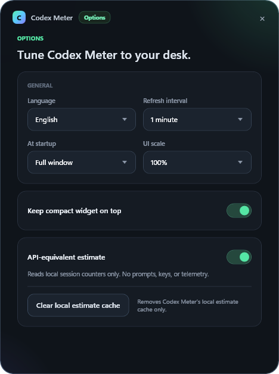
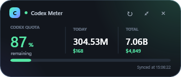
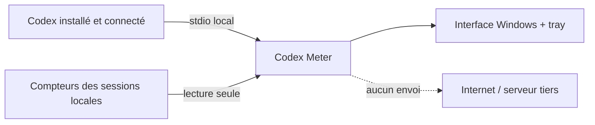

<div align="center">

[**English**](README.md) · **Français**

# Codex Meter

### Vos quotas Codex, visibles d'un coup d'œil.

Une petite application Windows native, élégante et **100 % locale** pour surveiller ses quotas, ses tokens et leur équivalent API sans garder `/usage` ouvert.

[](https://github.com/Ayoshy/Codex-Meter/actions/workflows/ci.yml)
[](https://github.com/Ayoshy/Codex-Meter/releases/latest)
[](https://dotnet.microsoft.com/download/dotnet/8.0)
[](#confidentialité-et-sécurité)
[](LICENSE)

**[Télécharger la dernière version autonome](https://github.com/Ayoshy/Codex-Meter/releases/latest/download/CodexMeter-win-x64-standalone.zip)**

</div>

---

## Captures d'écran

<div align="center">
  <table>
    <tr>
      <th>Tableau de bord</th>
      <th>Options</th>
    </tr>
    <tr>
      <td></td>
      <td></td>
    </tr>
    <tr>
      <th colspan="2">Widget compact</th>
    </tr>
    <tr>
      <td colspan="2" align="center"></td>
    </tr>
  </table>
</div>

## Ce que vous obtenez

| Quotas | Activité | Confort |
| --- | --- | --- |
| Pourcentage consommé et restant | Tokens du jour et cumulés | Widget compact détachable |
| Prochain reset | Équivalent estimé aux tarifs API | Icône dynamique dans le tray |
| Limites séparées par modèle | Série de jours d'utilisation | Actualisation automatique |
| Crédits de reset disponibles | Calcul entièrement local | Zoom de 80 % à 150 % |

Codex Meter affiche les crédits de reset fournis par OpenAI, mais ne propose volontairement aucun bouton pour les consommer.

## Installation

### Version autonome — recommandée

1. Téléchargez [`CodexMeter-win-x64-standalone.zip`](https://github.com/Ayoshy/Codex-Meter/releases/latest/download/CodexMeter-win-x64-standalone.zip).
2. Extrayez l'archive.
3. Lancez `CodexMeter.exe`.

Cette version embarque .NET. Elle demande uniquement Windows 10/11 et une installation Codex déjà connectée.

> [!NOTE]
> L'exécutable n'est pas encore signé. Windows SmartScreen peut donc afficher un avertissement au premier lancement. Les empreintes SHA-256 sont publiées avec chaque release.

### Depuis les sources

```powershell
git clone https://github.com/Ayoshy/Codex-Meter.git
cd Codex-Meter
dotnet run --project .\src\CodexUsageTray\CodexUsageTray.csproj
```

## Options

Ouvrez **Paramètres** depuis le menu du tray ou la roue dentée de la fenêtre complète. L’anglais est la langue par défaut ; passez instantanément en Français depuis l’écran Options ou le sous-menu `Langue` du tray.

Les réglages sont stockés localement dans `%LOCALAPPDATA%\CodexMeter\settings.json` : intervalle d’actualisation (1/5/15 minutes), comportement au démarrage (fenêtre complète, widget compact, tray uniquement ou dernière vue utilisée), échelle d’interface (80–150 %), premier plan du widget compact, dernière vue et dernière position de la fenêtre complète. L’estimation équivalente API peut être désactivée ; dans ce cas, Codex Meter n’énumère ni ne lit les fichiers de sessions locaux. **Effacer le cache local d’estimation** supprime uniquement le cache dérivé de Codex Meter, jamais les sessions Codex.

## Confidentialité et sécurité

Codex Meter fonctionne en lecture seule :

- il démarre localement `codex app-server --stdio` ;
- il appelle uniquement `account/rateLimits/read` et `account/usage/read` ;
- il laisse l'authentification à l'installation Codex existante ;
- il ne lit, ne copie et ne stocke aucun cookie, clé API, access token ou refresh token ;
- il ne transmet aucune donnée à un serveur tiers ;
- il ne consomme jamais de crédit de reset.

Pour estimer le coût API, l'application lit les compteurs de tokens et le nom du modèle dans les fichiers de session locaux. Elle ne conserve ni prompt, ni réponse, ni contenu de conversation. Son cache contient uniquement des compteurs agrégés ; les chemins locaux sont remplacés par des empreintes SHA-256 afin de ne pas exposer le nom du profil Windows.



Consultez [SECURITY.md](SECURITY.md) pour signaler une vulnérabilité de manière privée.

## À propos de l'estimation API

L'équivalent en dollars est une **estimation locale**, pas une facture. Il applique les tarifs publics entrée, entrée en cache et sortie au modèle détecté, puis rapproche le résultat du total officiel lorsque celui-ci est disponible.

Les tarifs GPT-5.6 Sol, Terra et Luna correspondent aux [tarifs officiels OpenAI](https://developers.openai.com/api/docs/models). Spark utilise provisoirement GPT-5.3-Codex comme proxy tant qu'aucun tarif final public distinct n'est disponible.

Le compteur du jour privilégie le bucket officiel. Si Codex ne publie encore que les journées clôturées, Codex Meter reconstruit la journée active depuis les compteurs locaux.

## Utilisation

- La fenêtre s'ouvre au premier lancement.
- **Masquer** ou fermer la fenêtre laisse l'application active dans la zone de notification.
- Un clic gauche sur l'icône la rouvre.
- Le menu contextuel permet d'actualiser ou de quitter.
- Le bouton de détachement bascule vers un widget compact.
- `Ctrl` + molette ajuste toute l'interface entre 80 % et 150 %.

Si Codex est installé dans un emplacement non standard :

```powershell
$env:CODEX_USAGE_TRAY_CODEX_PATH = "C:\chemin\vers\codex.exe"
```

## Développement

```powershell
dotnet build .\CodexUsageTray.sln --configuration Release
dotnet run --project .\tests\CodexUsageTray.Tests\CodexUsageTray.Tests.csproj --configuration Release
```

Créer une publication légère utilisant le runtime .NET 8 installé :

```powershell
.\scripts\publish.ps1
```

Créer un exécutable autonome :

```powershell
.\scripts\publish.ps1 -SelfContained
```

Les sorties restent sous `artifacts\`, qui n'est jamais versionné.

## Contribuer

Les issues et pull requests sont les bienvenues. Le projet vise une surface réduite : lecture seule, locale, rapide et transparente. Voir [CONTRIBUTING.md](CONTRIBUTING.md).

## Licence et statut

Distribué sous licence [MIT](LICENSE).

Codex Meter est un projet communautaire indépendant. Il n'est ni affilié à OpenAI, ni approuvé par OpenAI. « OpenAI » et « Codex » sont des marques de leurs propriétaires respectifs.
