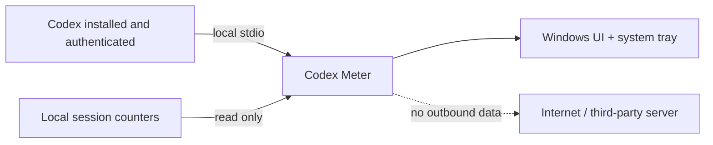

<div align="center">

**English** · [**Français**](README.fr.md)

# Codex Meter

### Your Codex usage, visible at a glance.

A small, elegant and **100% local** native Windows app for monitoring your quotas, tokens and estimated API-equivalent cost without keeping `/usage` open.

[](https://github.com/Ayoshy/Codex-Meter/actions/workflows/ci.yml)
[](https://github.com/Ayoshy/Codex-Meter/releases/latest)
[](https://dotnet.microsoft.com/download/dotnet/8.0)
[](#privacy-and-security)
[](LICENSE)

**[Download the latest standalone build](https://github.com/Ayoshy/Codex-Meter/releases/latest/download/CodexMeter-win-x64-standalone.zip)**

</div>

---

## Screenshots

<div align="center">
  <table>
    <tr>
      <th>Main dashboard</th>
      <th>Options</th>
    </tr>
    <tr>
      <td></td>
      <td></td>
    </tr>
    <tr>
      <th colspan="2">Compact widget</th>
    </tr>
    <tr>
      <td colspan="2" align="center"></td>
    </tr>
  </table>
</div>

## What you get

| Quotas | Activity | Convenience |
| --- | --- | --- |
| Used and remaining percentages | Daily and lifetime tokens | Detachable compact widget |
| Next reset time | Estimated API-equivalent cost | Dynamic system tray icon |
| Per-model limits | Usage streak | Automatic refresh |
| Available reset credits | Fully local calculation | Zoom from 80% to 150% |

Codex Meter displays reset credits provided by OpenAI, but deliberately offers no button to consume them.

## Installation

### Standalone build — recommended

1. Download [`CodexMeter-win-x64-standalone.zip`](https://github.com/Ayoshy/Codex-Meter/releases/latest/download/CodexMeter-win-x64-standalone.zip).
2. Extract the archive.
3. Run `CodexMeter.exe`.

This build bundles .NET. It only requires Windows 10/11 and an existing authenticated Codex installation.

> [!NOTE]
> The executable is not signed yet, so Windows SmartScreen may display a warning on first launch. SHA-256 checksums are published with every release.

### From source

```powershell
git clone https://github.com/Ayoshy/Codex-Meter.git
cd Codex-Meter
dotnet run --project .\src\CodexUsageTray\CodexUsageTray.csproj
```

## Options

Open **Settings** from the tray menu or the gear in the full window. English is the default language; switch to Français instantly from either the Options screen or `Language` in the tray menu.

Options are stored locally in `%LOCALAPPDATA%\CodexMeter\settings.json` and cover the refresh interval (1/5/15 minutes), startup behavior (full window, compact widget, tray only, or last used view), UI scale (80–150%), compact-widget corner and always-on-top behavior, optional launch with Windows, the last view, and the last full-window position. API-equivalent estimation can be disabled; when disabled, Codex Meter does not enumerate or read local session files. **Clear local estimate cache** only removes Codex Meter’s derived cache, never Codex sessions. **Reset settings** restores the application defaults.

## Privacy and security

Codex Meter operates in read-only mode:

- it starts `codex app-server --stdio` locally;
- it only calls `account/rateLimits/read` and `account/usage/read`;
- authentication remains entirely managed by the existing Codex installation;
- it never reads, copies or stores cookies, API keys, access tokens or refresh tokens;
- it sends no data to third-party servers;
- it never consumes reset credits.

To estimate API-equivalent cost, the app reads token counters and model names from local Codex session files. It retains no prompts, responses or conversation content. Its cache only contains aggregated counters, and local paths are replaced with SHA-256 hashes so the Windows profile name is never exposed.



See [SECURITY.md](SECURITY.md) to report a vulnerability privately.

## About the API estimate

The dollar equivalent is a **local estimate**, not a bill. It applies public input, cached-input and output prices to the detected model, then reconciles the result with the official lifetime total when available.

GPT-5.6 Sol, Terra and Luna use the [official OpenAI prices](https://developers.openai.com/api/docs/models). Spark temporarily uses GPT-5.3-Codex as a proxy until a separate final public price is available.

The daily counter prefers the official usage bucket. If Codex only reports completed days, Codex Meter reconstructs the active day from local counters.

## Usage

- The window opens on first launch.
- **Hide** or closing the window keeps the app running in the system tray.
- Left-click the tray icon to reopen it.
- Use the context menu to refresh or exit.
- The detach button switches to a compact widget.
- `Ctrl` + mouse wheel scales the entire interface from 80% to 150%.

If Codex is installed in a non-standard location:

```powershell
$env:CODEX_USAGE_TRAY_CODEX_PATH = "C:\path\to\codex.exe"
```

## Development

```powershell
dotnet build .\CodexUsageTray.sln --configuration Release
dotnet run --project .\tests\CodexUsageTray.Tests\CodexUsageTray.Tests.csproj --configuration Release
```

Create a lightweight build that uses an installed .NET 8 runtime:

```powershell
.\scripts\publish.ps1
```

Create a standalone executable:

```powershell
.\scripts\publish.ps1 -SelfContained
```

All output remains under `artifacts\`, which is never committed.

## Contributing

Issues and pull requests are welcome. The project intentionally keeps a narrow scope: read-only, local, fast and transparent. See [CONTRIBUTING.md](CONTRIBUTING.md).

## License and status

Distributed under the [MIT License](LICENSE).

Codex Meter is an independent community project. It is not affiliated with or endorsed by OpenAI. “OpenAI” and “Codex” are trademarks of their respective owners.
